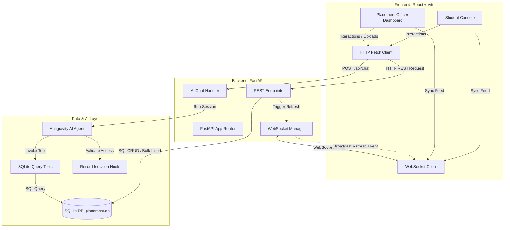

# PlaceTrack - College Placement Tracker & AI Assistant

PlaceTrack is a real-time college placement tracking platform featuring a **React + Vite** frontend and a **FastAPI + SQLite** backend. It provides a dual-console experience for both students and placement officers, augmented by a secure, role-based AI Assistant chatbot powered by the **Google Antigravity SDK**.

---

## 🏗️ System Architecture

The following diagram illustrates how the frontend console, the FastAPI backend, the SQLite storage, and the Antigravity AI Agent interact in real-time.



---

## 📁 Workspace Structure

```bash
College Placement Tracker UI/
├── backend/
│   ├── placement.db          # Live SQLite database file
│   ├── main.py               # FastAPI server entry point and WebSocket setup
│   ├── database.py           # SQLite schema definitions and seeder (TCS, Infosys, etc.)
│   ├── agent.py              # Antigravity Agent tools and RecordIsolationHook
│   └── requirements.txt      # Python backend dependencies
├── frontend/
│   ├── src/                  # React components, style sheets, and pages
│   │   ├── pages/
│   │   │   ├── Login.tsx     # Student & Officer login gate
│   │   │   └── OfficerDashboard.tsx # Placement Officer sheet & controls
│   │   ├── App.tsx           # Student dashboard and main router
│   │   ├── index.css         # Tailwind CSS v4 imports
│   │   └── main.tsx          # React application entry point
│   ├── index.html            # Vite entry point shell
│   ├── tsconfig.json         # TypeScript configuration
│   ├── vite.config.ts        # Vite build config with Figma Make integration
│   └── package.json          # Frontend packages and scripts
├── package.json              # Workspace root delegate scripts
└── README.md                 # System overview and walkthrough
```

---

## 🚀 Getting Started

### 1. Backend Setup (FastAPI + SQLite)
Ensure you have Python 3.10+ installed. Navigate to the root directory and install dependencies:

```bash
# Install required Python packages
pip install -r backend/requirements.txt

# (Optional) Re-seed the SQLite database with 30 clean records
python backend/database.py

# Start the FastAPI server locally
python backend/main.py
```
*The backend server will run on `http://localhost:8000`.*

### 2. Frontend Setup (React + Vite + Tailwind v4)
Vite handles local builds and hot-module replacement (HMR).

```bash
# Install frontend dependencies
npm install

# Run the local development server
npm run dev
```
*The development server will run on `http://localhost:8443`.*

---

## 🔑 Demo Access Credentials

| Role | Login ID | Password | Access Rights |
| :--- | :--- | :--- | :--- |
| **Placement Officer** | `OFFICER` | `admin` | Full spreadsheet control, drive management, global statistics, unrestricted AI Chatbot queries |
| **Student** | `STU_101` to `STU_130` | `1234` | Personal status dashboard, applications history, isolated AI chatbot queries (restricted to own records) |

---

## 🛠️ Key Technical Features

1. **Role-Based Record Isolation Hook:** Ensures students cannot query or access another student's placement stages or salaries via the AI chatbot, throwing an `Access Denied` error for policy violations.
2. **WebSocket Sync:** When the Placement Officer makes edits (e.g., updates a student's stage to `"Selected"` or uploads a spreadsheet), a refresh signal is broadcasted over WebSockets, instantly updating student views.
3. **Structured Spreadsheet Uploads:** Supports parsing `.xlsx` or `.csv` files inside the Officer portal to extract columns and insert records directly into SQLite.
